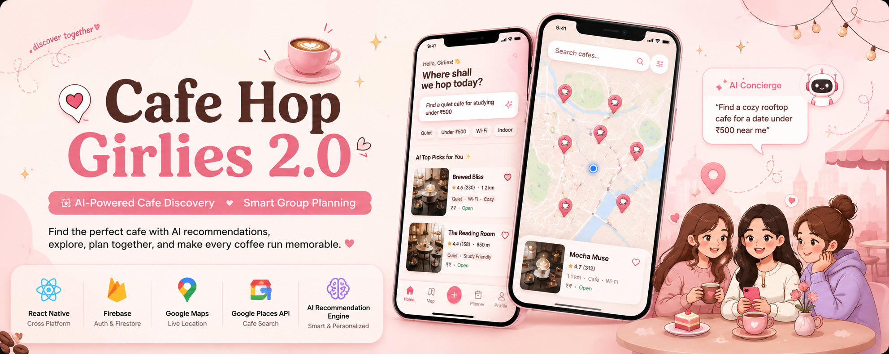
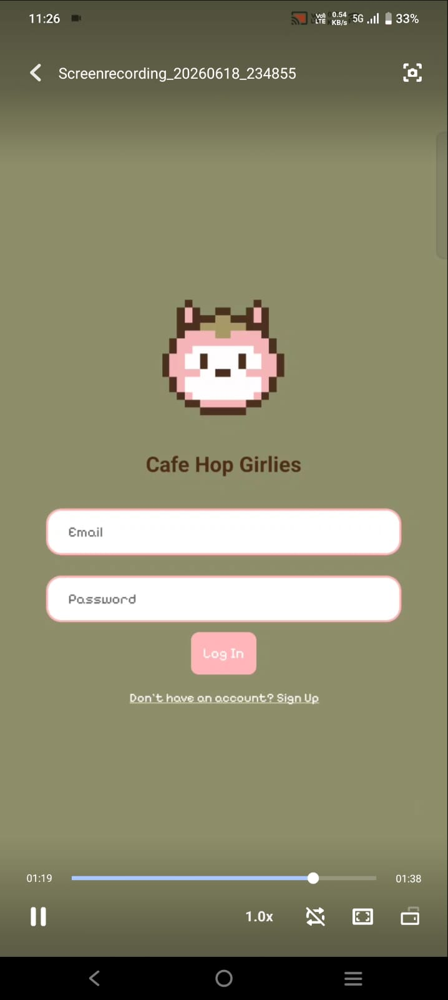
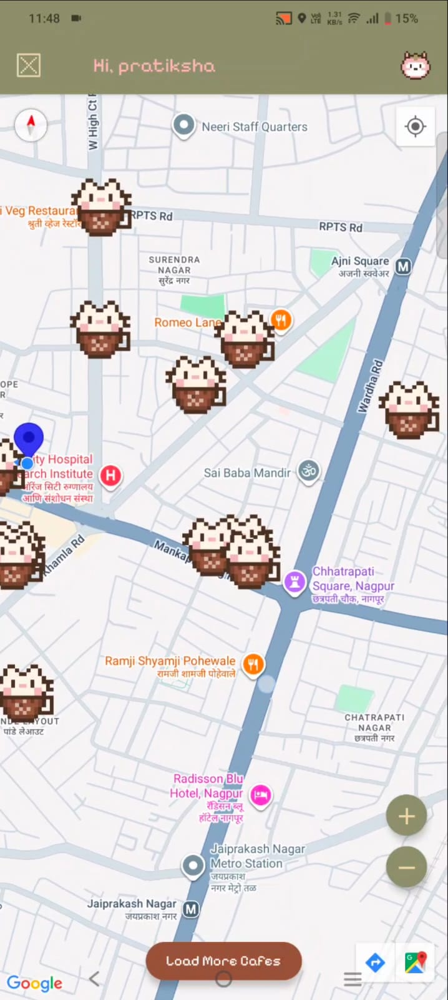
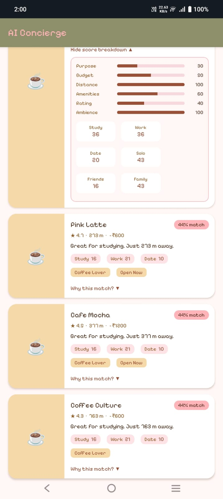
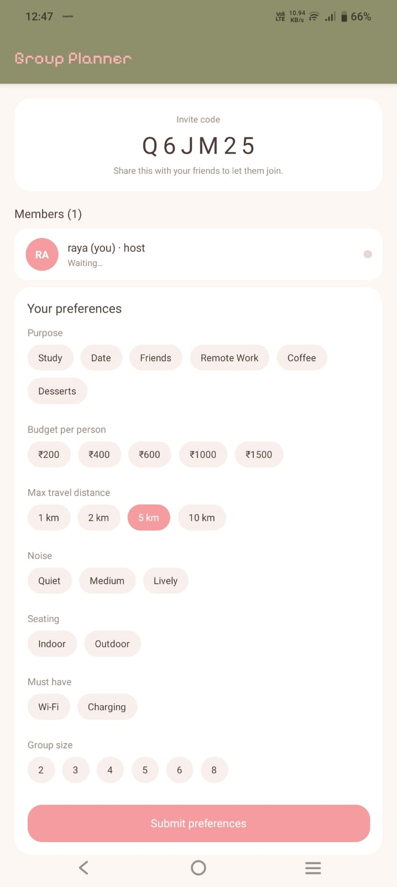
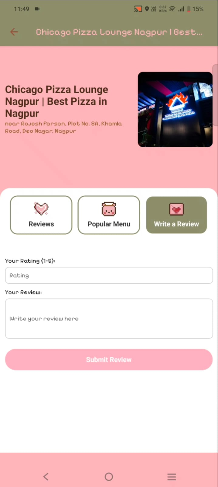
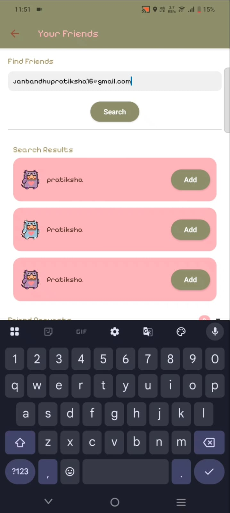

<p align="center">
  
</p>

<h1 align="center">
☕ Cafe Hop Girlies 
</h1>

<p align="center">
Discover cafés smarter with AI, personalized recommendations,
interactive maps, and collaborative group planning.
</p>

<p align="center">


</p>

---

# 🌸 About the Project

Cafe Hop Girlies is a modern AI-powered mobile application built with React Native and Expo that helps users discover cafés based on their preferences instead of simply displaying nearby locations.

The app combines Google Maps, Firebase Authentication, Firestore, AI-powered recommendations, and collaborative group planning into one seamless experience—making it easier for individuals and groups to find the perfect café.

---
# 🎥 Demo

### 🗺️ Cafe Discovery
▶️ [Watch Demo](assets/readme/videos/demo3.mp4)

### 🤖 AI Cafe Concierge
▶️ [Watch Demo](assets/readme/videos/demo2.mp4)

### 👥 Group Planner
▶️ [Watch Demo](assets/readme/videos/demo1.mp4)
---
# 📸 Screenshots

<p align="center">







</p>

<p align="center">







</p>

---
# ✨ Features

- 🤖 AI-powered cafe Concierge
- 🗺️ Google Maps integration
- 📍 Real-time nearby cafe discovery
- 👥 Collaborative Group Planner
- ⭐ Cafe ratings and reviews
- 🔐 Firebase Authentication
- ☁️ Firestore backend
- 📱 Modern React Native UI

---
# 🛠️ Tech Stack

- React Native
- Expo
- Firebase Authentication
- Cloud Firestore
- Google Maps Platform
- Google Places API
- Gemini AI

---

# 🌟 Why Cafe Hop Girlies?

Unlike traditional café finder apps, Cafe Hop Girlies combines AI-powered recommendations, real-time location intelligence, and collaborative group planning to help users discover cafés that match both individual and group preferences.

---
# 🚀 Getting Started

```bash
git clone https://github.com/PratikshaJ-16/cafe-hop-girlies.git

cd cafe-hop-girlies

npm install

npx expo start
```

---
# 👩‍💻 Author

**Pratiksha Janbandhu**

- GitHub: https://github.com/PratikshaJ-16
- LinkedIn: https://www.linkedin.com/in/pratiksha-janbandhu

---

⭐ If you found this project interesting, consider giving it a star!